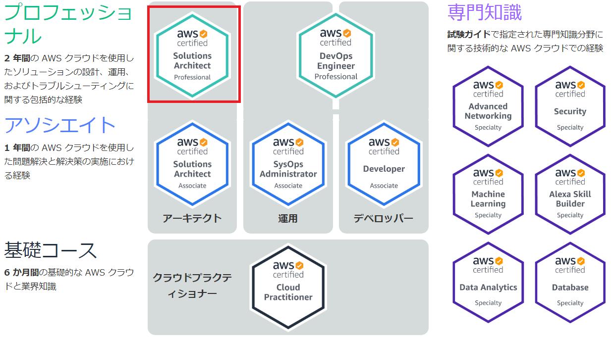
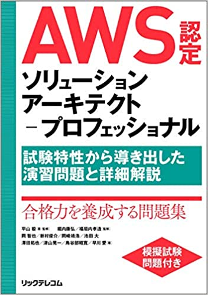
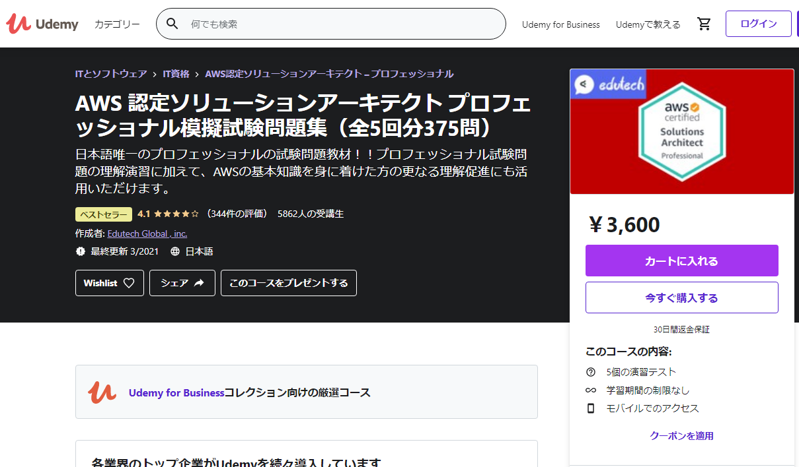
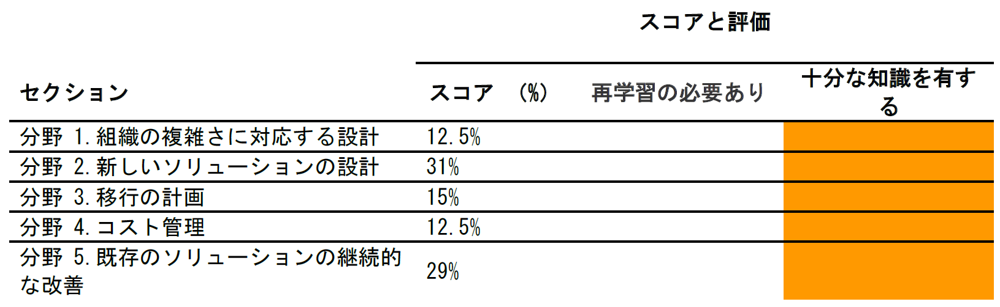

<!--
class: title
-->

# 実務経験1年の AWS認定ソリューションアーキテクト プロフェッショナル受験記録

---
<!--
class: slides
footer: '実務経験1年の AWS 認定 SAP 受験記録'
paginate: true
-->

# 自己紹介
## 木田 顕啓（きだ あきひろ）

所属：
　第四事業部　開発技術担当

職務：
　クラウドアーキテクト
　DevOps エンジニア

好きな AWS サービス：
　IAM (Identity and Access Management)

---

# AWS 認定 SAP

AWS 認定の中でも課題を解決するソリューションのアーキテクチャを設計するスキルを認定する

---

<!--
_class: slides_2
-->
# 実務経験
AWS 実務経験は1年ほどで推奨の2年よりも短いが、全体に主体的に関われていればそこそこにいけるという感触
実務経験で触れていた AWS サービスは以下
No.|サービス名|No.|サービス名|No.|サービス名|No.|サービス名
:-|:-|:-|:-|:-|:-|:-|:-
1|ALB|9|CloudWatch|17|InternetGateway|25|S3 Glacier
2|Amazon SageMaker|10|Detective|18|KMS|26|Systems Manager
3|CloudFormation|11|Direct Connect|19|Lambda|27|VPC
4|CloudTrail|12|ECR|20|RDS（Aurora）|28|VPCエンドポイント
5|CodeBuild|13|EC2|21|Route53|29|WAF
6|CodeCommit|14|Fargate|22|SNS|30|Kinesis Data Firehose
7|CodePipeline|15|GuardDuty|23|StepFunctions||
8|Config|16|IAM|24|S3||

---

# 学習に利用したもの
学習に利用したのは以下4つ
- AWS 認定 SAP 向け問題集
- Udemyの模擬試験
- AWS 公式 Black Belt 資料
- AWS 公式 Well-Architected 資料

---

# 学習方法
学習方法は以下の順でやったが、先に AWS 公式資料を見ておいた方が良かった。
1. 問題集の説明箇所を学習
1. 問題集の模擬試験を2時間ほどで実施（この時65点）
1. Udemy の模擬試験を2時間ほどで実施（平均60点程度）
1. 試験日直前に AWS 公式資料で苦手な部分を補完学習

---

# 学習ポイント
基本的には自身の実務経験がないところを重点的に学習しておいた方が良い
頻出問題だなと感じたのは以下のあたり
 - 移行（アプリケーション移行、データ移行）
 - 複数アカウントの管理
 - フェデレーション
 - コスト系（リクエスタ払い、SPOT インスタンス）
 - CDN 系
 - マネージド機械学習サービスの利用
 - ストリームデータの扱い

---
# 受験場所
ピアソン VUE か PSI のテストセンターを選べる
ピアソン VUE では現在自宅でのリモート受験も可能

歩いて行ける距離にピアソン VUE のテストセンターがあったためそこで受験
自宅で受けるのは面倒そうだったためやめた

当日の流れなどはトレノケートの以下の記事を参照するのが良い
- [ピアソンVUE](https://blog.trainocate.co.jp/blog/aws10points2_005)
- [PSI](https://blog.trainocate.co.jp/blog/aws_10points)

---
# 受験中
- 普通に3時間ぎりぎりまで使った
- 見直しフラグは全然使わなかったが無回答確認はした
- 受付の人ちょっと怖かった
- 合否だけは即時表示されるが、記録したりできないので本当に受かったのか疑心暗鬼になった
- Udemy の模擬テストの方が難しいやんけ！！！

---

# 受験後
結果の詳細が出ると通知がある
1000点満点中840点（合格ラインは750点）
※詳細は右記だけどよくわかんないね

合格していると認定バッチがもらえる
Linkedin などの SNS と連携すると証明になる

---

# 最後に
ぶっちゃけるとここを見るのが一番良いし自分もそうやった（ぶん投げ）
[AWS認定11冠制覇したのでオススメの勉強法などをまとめてみる（qiita）](https://qiita.com/nakazax/items/20458e146d3d9f2aa615)

会社的に必要だからとかあると思うけど、珍しく試験内容が実務的で勉強になったので、趣味で取得するにもオススメ
みんなも認定されてアピールしていこう！