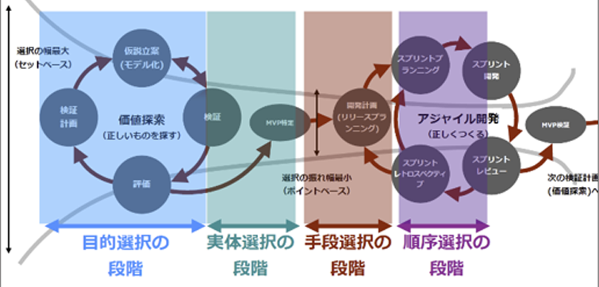

<!--
class: title
-->

# 問題解決を高効率で効果的に
# 進めるフレームワーク

---
<!--
class: slides
footer: '問題解決を高効率で効果的に進めるフレームワーク'
paginate: true
-->

# 自己紹介
## 木田 顕啓（きだ あきひろ）

所属：
　第四事業部　第三統括部　開発技術担当

職務：
　クラウドアーキテクト
　DevOps エンジニア

好きな AWS サービス：
　IAM (Identity and Access Management)

---
# 伝えたいこと
せっかく頑張ってやったことがあまり効果的でないように見えるときって悲しいですよね

**良かれと思って問題を解決したのに誰にも影響がなかった**、なんて泣いてしまいます

この LT は「そもそもやる必要なかったのでは？」、「もうちょっと早くやっていてくれたら・・・」なんて言われないように**高効率で効果的に問題解決をするノウハウを共有**するものです

---

# 課題
問題解決が非効率で、効果的でなくなるのは以下のような課題があるためと考えます

* **時間をかけるべきポイント**がずれていて効果が薄まっている
* **一気に全部**やろうとして非効率になっている

---

# 課題の原因
前述の課題の背景には以下のような原因があるのではないかと考えます
* 不確実性の高い部分って整理するのつらいから**見えているものに飛びついてしまう**
* **自分が困っていることはみんなも困っているはず**という思い込みがある
* 最初に見つけ出した対策は**時間が経っても効果的**なままであるという思い込みがある
* プロジェクトの実施プロセスとして **WF スタイル**に慣れている

---
<!-- _class: split -->
# 解決手段

以下のプロセスを問題解決の基本フレームワークとすることを提案します

#### 探索フェーズ
1. 現状・背景を調べる
1. **問題を定義する (重要)**
1. **指標値を見つける (重要)**
1. 対策を立案する

#### 実行フェーズ
1. **対策の優先順を決める (重要)**
1. 優先順の一番高い対策を実施する
1. 指標値を確認する

---
# 解決手段
仮説検証型アジャイル開発の手法に近い

※書籍「正しいものを正しくつくる」より抜粋

---

# 問題の定義
1. 問題定義 (繰り返す)
    1. 現状や背景をもとに問題の仮説を立てる
    1. 現場にヒアリングし、仮説立てた問題がペインポイントになっているかを確認する
    1. 新たな情報が手に入るのでそこを深堀して仮説を修正する
1. 対策方針決定 (繰り返す)
    1. 問題を取り除いた状態を想像できるように表現する
    1. 上記状態を想像してもらい、ペインポイントが解消しているかを確認する

---
# 問題の定義
「世の中にある『問題かもしれない』と言われていることのほとんどは、実はビジネス・研究上で本当に取り組む必要のある問題ではない。世の中で『問題かもしれない』と言われていることの総数を 100 とすれば、今、この局面で本当に白黒をはっきりさせるべき問題はせいぜい 2 つか 3 つくらいだ。」

※書籍「イシューからはじめよ」より

---
# 指標値を見つける
問題の解消度合を評価できる指標値を見つけ出す
直接的な値が取れない場合は相関する値を設定する
* 1月にかかっているランニングコスト
* 利用者満足度・・・は取れないので
    * アクティブユーザ数
* 組織健全度・・・は直接表現できないので
    * リリース頻度
    * チャット発言量
* 品質・・・は直接表現できないので
    * UT カバレッジ率

---

# 対策の優先順を決める
1. 実現がきわめて困難なものがある場合は除外する
1. 除外後の対策リストを効果が高い順に並べる
1. **上位 20 % をまず実施するべき対象**とする (パレートの法則)
1. **1 つ実施したら指標値を確認して対策リストの順序を見直す**

→**ボトルネックは移動する**可能性があるため効果的な部分を実施したら、次に実施するものを再確認した方が良い
→指標値が目標の水準まで達していたらその時点で終了する
→使用できるコストが上限まで達していたらその時点で終了する

---

# 効果
* **時間をかけるべきポイント**がずれていて効果が薄まっている
→問題定義と指標値の設定の筋が良ければ高い効果を発揮する

* **一気に全部**やろうとして非効率になっている
→効果の高い対策を一番に実施することで効果の高さ×それが効いている期間が最大化されるため効率が良い

---

# まとめ
1. 探索フェーズと実行フェーズをわけてループすることで問題解決の効果と効率それぞれを高めるフレームワークを提案しました
1. 問題定義と指標値の設定を適切に行うことで効果を高められます
1. 効果の高い対策を早く実現するのをくりかえすことで効率を高められます
