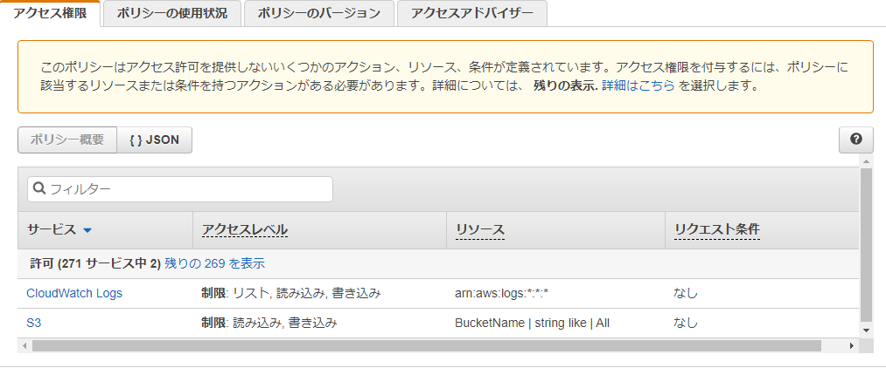
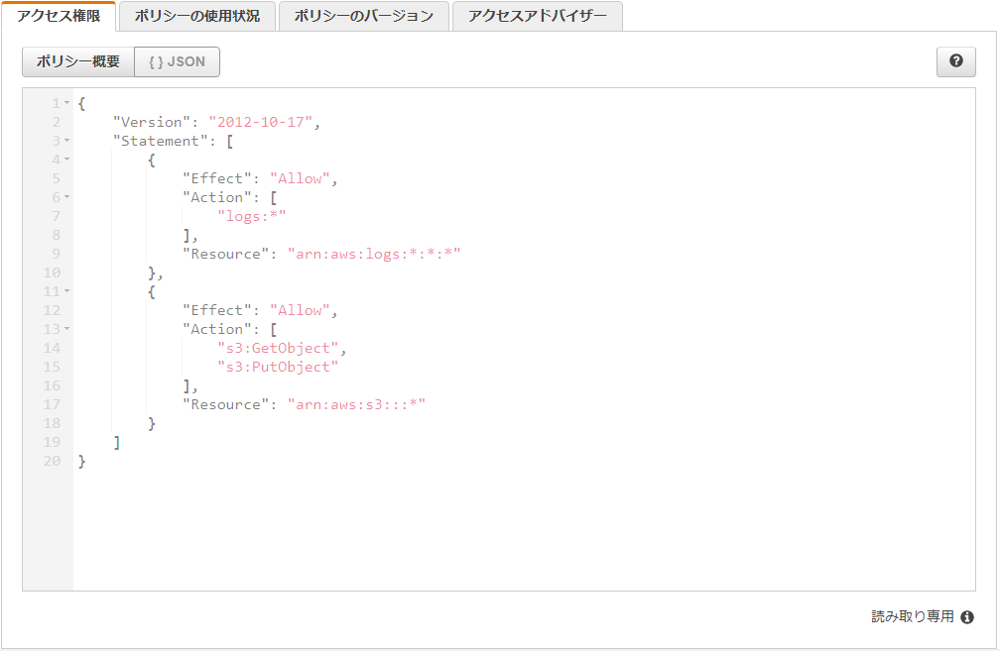

<!--
class: title
-->

# 5分で完全に理解する  AWS IAM
(**I**dentity and **A**ccess **M**anagement)

---
<!--
class: slides
footer: '5分で完全に理解する AWS IAM'
paginate: true
-->

# 自己紹介
## 木田 顕啓（きだ あきひろ）

所属：
　第四事業部　開発技術担当

職務：
　クラウドアーキテクト
　DevOps エンジニア

好きな AWS サービス：
　IAM (Identity and Access Management)

---

# IAMとは

認証と認可をつかさどる AWS サービス

---

# 認証
認証すなわち個人の特定は主に IAM User によってなされる

以下のセットで認証する
- AWS アカウント ID
- IAM User
- パスワード
- (多要素認証)

---

# 認可 (Group)
認可は IAM User に個別に設定することもできるが、手間がかかるため IAM Group で IAM User をグルーピングして認可を行うことが一般的である

---

# 認可 (Role)
IAM Userに対する認可は人の操作に対してだが、AWSサービス等に対して認可したい場合がある

その際に利用されるのが IAM Role である

---

# 認可 (Role)
 IAM Role は名前の通り役割なので、認可をうけたいもの  (＝エンティティ)が AssumeRole (役割の引き受け) する
 
 エンティティの例：
 - IAM User
 - IAM Role
 - AWSサービス

---

# 認可 (Role)
 IAM Role は名前の通り役割なので、認可をうけたいもの  (＝エンティティ)が AssumeRole (役割の引き受け) する
 
 エンティティの例：
 - IAM User **(←ん？何これ？)**
 - IAM Role **(←ん？何これ？)**
 - AWSサービス

---

# 認可 (Role)
 IAM Role だけは他の AWS アカウントに属するエンティティでも引き受けることが可能
 
 これによりクロスアカウントアクセスをセキュアに実現できる

---

# 複数アカウント運用例
- 各アカウントで認証するのは無駄が多い
- 認可は IAM Role で定義
- どの IAM Role に AssumeRole できるかの認可のみ IAM Group で実現

---

# ポリシー
AWSにおいて認可の詳細は ABAC (**A**ttribute-**B**ased **A**ccess **C**ontrol) と呼ばれる認可戦略をとる
